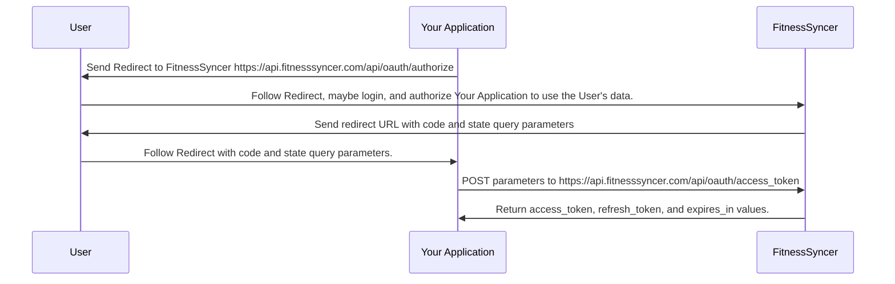
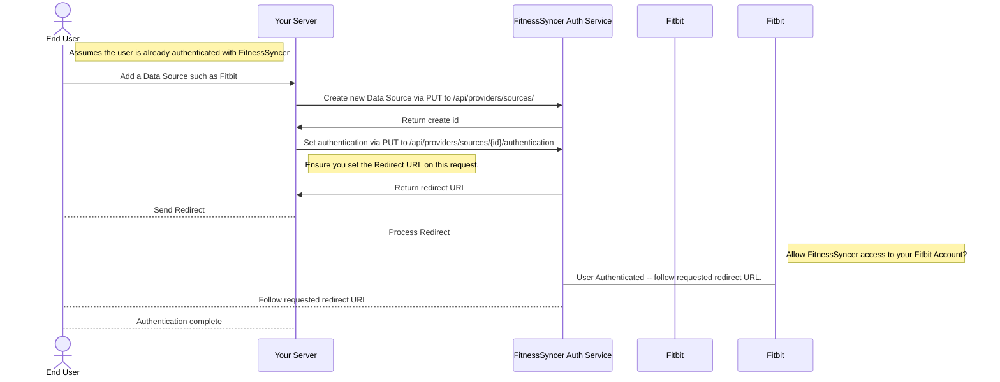

# FitnessSyncer OpenAPI Specification

[FitnessSyncer](https://www.fitnesssyncer.com) provides an API to help our users access their health and fitness data from over [50 sources](https://www.fitnesssyncer.com/support/supported-apps-and-services). Our OAuth-based REST API allows you to seamlessly get to the data, no matter the source, and concentrate on building their application, not integrating with services.

The contains our [OpenAPI specification](FitnessSyncer.yaml) which allows you to quickly generate code for your applications.

For complete documentation, please review [our documentation](https://www.fitnesssyncer.com/api/documentation.html) and create your personal credentials [here](https://www.fitnesssyncer.com/account/developer).

For non-personal usage or for any assistance, please [contact us](https://www.fitnesssyncer.com/ContactUs.html).

## Diagrams

### Authentication Sequence Diagram

See [Authentication Sequence Diagram](https://www.fitnesssyncer.com/api/documentation.html#authenticating) for all of the parameters and details.

### Source and Destination Authentication Sequence Diagram

See [Create Data Source](https://api.fitnesssyncer.com/api/documentation.html#data_source_create) and [Provider Authentication](https://api.fitnesssyncer.com/api/documentation.html#provider_authentication)

### Data Structure Overview

```mermaid
classDiagram

  SyncItemItem ..> SyncItem
  SyncItem ..> TaskType
  Activity ..> GPSData
  GPSData ..> Lap
  Lap ..> Point
  Point ..> LatLng
  Glucose ..> GlucosePoint
  Oxygen ..> OxygenPoint
  Sleep ..> SleepEvent
  Sleep ..> SleepPoint
  Temperature ..> TemperaturePoint
  ListSourceData ..> SyncItemListItem
  ListSyncItems ..> SyncItem
  SyncItemListItem ..> SyncItemLinks
  ListOfSourceData ..> SourceData
  SourceDataItem ..> SourceData
  ListDestinationTask ..> DestinationTask
  DestinationTaskItem ..> DestinationTask
  SyncDestination ..> TaskType
  AlertDestination ..> TaskType
  ListTaskType ..> TaskType
  ProviderList ..> Provider
  ProviderAuthentication ..> ProviderAuthenticationItem
  ProviderAuthenticationItem ..> ProviderAuthenticationKey
  SyncStatusResults ..> SyncStatus
  Notification ..> Subscription
  DescriptionResults ..> Description
  Description ..> TaskType
  LeaderboardList ..> Leaderboard
  LeaderboardItem ..> Leaderboard

  class PowerZones{
    +number: base
    +number: maxZone1
    +number: maxZone2
    +number: maxZone3
    +number: maxZone4
    +number: maxZone5
    +number: maxZone6
  }
  class Error{
    +string: error
    +string: error_description
    +string: argument
    +string: item
    +string: id
    +string: request_id
  }
  class UserPreferences{
    +bool: autosync
    +number: bmr
    +number: birthdate
    +number: age
    +bool: canemail
    +bool: distanceOverSteps
    +bool: privateActivities
    +number: heightInMeters
    +bool: distanceMetric
    +bool: nutritionMetric
    +bool: weightMetric
    +bool: glucoseMetric
    +bool: temperatureCelsius
    +bool: waterML
    +bool: internationaltime
    +bool: weekStartsOnMonday
    +string: locale
    +string: numericLocale
    +string: bodyshape
    +string: sex
    +string: timezone
    +string: timezoneDisplayName
    +string: displayname
    +number: heartRateLevel1
    +number: heartRateLevel2
    +number: heartRateLevel3
    +number: heartRateLevel4
    +number: heartRateLevel5
    +number: heartRateAge
    +number: heartRateMax
    +bool: pro
    +bool: beta
    +object: powerZones
    +number: sleepRatio
    +bool: graphSleepByWakeTime
    +number: glucoseLow
    +number: glucoseHigh
    +number: glucosePercent
  }
  class SyncItemItem{
    +SyncItem: item;
  }
  class SyncItem{
    +string: providerType
    +number: date
    +string: itemId
    +string: taskId
    +string: comment
    +string[]: tags
    +TaskType: type;
  }
  class Activity{
    +string: activity
    +string: fitnessSyncerActivity
    +string: title
    +number: distanceKM
    +number: duration
    +number: calories
    +number: bmr
    +number: endDate
    +number: steps
    +number: avgHeartrate
    +number: minHeartrate
    +number: maxHeartrate
    +number: restingHeartrate
    +number: avgStressLevel
    +number: minStressLevel
    +number: maxStressLevel
    +number: lowStressDurationSeconds
    +number: mediumStressDurationSeconds
    +number: highStressDurationSeconds
    +number: vo2Max
    +number: respiratoryRate
    +number: mindfulMinutes
    +bool: summary
    +number: temperatureCelsius
    +number: repetitions
    +number: weight
    +bool: manual
    +number: floorsClimbed
    +GPSData: gps;
  }
  class Allergy{
    +string: allergy
    +bool: isNegated
    +string: treatment
    +number: endDate
  }
  class GPSData{
    +string: id
    +string: title
    +string: sport
    +number: date
    +Lap[]: lap;
  }
  class Lap{
    +number: start
    +number: millis
    +number: totalMovingTimeMillis
    +number: totalMovingTimeMillisCalc
    +number: dist
    +number: calories
    +number: speed
    +number: maxHeart
    +number: avgHeart
    +number: cadence
    +string: sport
    +number: notes
    +number: hrr
    +Point[]: points;
  }
  class Point{
    +number: time
    +number: distance
    +number: altitude
    +number: heartRate
    +number: speed
    +number: cadence
    +number: calories
    +number[]: hrv
    +number: hrv_sdnn
    +number: power
    +number: estimatedPower
    +number: temp
    +number: steps
    +number: torque
    +number: locationAccuracy
    +number: bearing
    +number: tilt
    +number: pedometerCadence
    +number: crankCadence
    +number: crankRevolutionDelta
    +number: wheelCadence
    +number: wheelRevolutionDelta
    +bool: moving
    +number: stanceTime
    +number: legSpringStiffness
    +number: stress
    +number: formPower
    +number: verticalOscilation
    +number: vo2Max
    +number: respiratoryRate
    +LatLng: point;
  }
  class LatLng{
    +number: lat
    +number: lng
  }
  class BodyComposition{
    +number: weight
    +number: height
    +number: fatFreeMass
    +number: fatRatio
    +number: boneMass
    +number: bodyWaterKg
    +number: bmi
    +number: muscleMass
    +number: fatMassWeight
    +number: bicep
    +number: calf
    +number: chest
    +number: forearm
    +number: hips
    +number: neck
    +number: thigh
    +number: waist
    +number: caliperChest
    +number: caliperMidaxillary
    +number: caliperBicep
    +number: caliperAbdominal
    +number: caliperSuprailiac
    +number: caliperThigh
    +number: caliperCalf
    +number: caliperSubscapular
    +number: caliperTricep
    +number: caliperLowerBack
  }
  class BloodPressure{
    +number: diastolic
    +number: systolic
    +number: pulse
    +bool: arrhythmia
  }
  class Cholesterol{
    +number: ldl
    +number: hdl
    +number: totalCholesterol
    +number: triglyceride
  }
  class Condition{
    +string: condition
    +number: endDate
  }
  class Glucose{
    +number: value
    +bool: a1c
    +string: measurementType
    +string: measurementContext
    +GlucosePoint[]: entries;
  }
  class GlucosePoint{
    +number: time
    +number: value
  }
  class Medication{
    +string: medication
    +number: dose
    +string: doseUnit
    +number: strength
    +string: strengthUnit
    +number: endDate
  }
  class Nutrition{
    +string: food
    +string: meal
    +string: mealApproximation
    +number: calories
    +number: carbohydrates
    +number: fat
    +number: fiber
    +number: protein
    +number: sugar
    +number: cholesterol
    +number: saturatedFat
    +number: sodium
    +number: iron
    +number: potassium
    +number: vitaminA
    +number: vitaminC
    +number: vitaminD
    +number: calcium
    +number: glycemicLoad
    +number: water
  }
  class Oxygen{
    +number: spo2
    +number: pulse
    +OxygenPoint[]: entries;
  }
  class OxygenPoint{
    +number: time
    +number: spo2
    +number: pulse
  }
  class Sleep{
    +number: bedTime
    +number: awakeTime
    +number: sleepingMinutes
    +number: awakenings
    +number: efficiency
    +number: settlingMinutes
    +number: lightSleepMinutes
    +number: l2SleepMinutes
    +number: l3SleepMinutes
    +number: deepSleepMinutes
    +number: remSleepMinutes
    +number: awakeMinutes
    +number: avgHR
    +number: avgRR
    +number: hrvRmssdEvening
    +number: hrvRmssdMorning
    +SleepEvent[]: sleepEvents;
    +SleepEvent[]: inferredSleepEvents;
    +SleepPoint[]: sleepPoints;
  }
  class SleepEvent{
    +string: type
    +number: offsetMinutes
    +number: durationMinutes
  }
  class SleepPoint{
    +number: time
    +number: heartRate
    +number: respiratoryRate
    +number: hrv_sdnn
  }
  class Temperature{
    +number: temperature
    +TemperaturePoint[]: entries;
  }
  class TemperaturePoint{
    +number: time
    +number: value
  }
  class Id{
    +string: id
  }
  class HistoricSync{
    +number: start
    +number: end
    +bool: email
  }
  class HistoricSyncStatus{
    +string: status
    +string: summary
    +double: percentComplete
    +number: queueTime
    +number: startPeriod
    +number: endPeriod
    +number: currentStartPeriod
    +number: currentEndPeriod
  }
  class ListSourceData{
    +SyncItemListItem[]: items;
  }
  class ListSyncItems{
    +SyncItem[]: items;
  }
  class SyncItemListItem{
    +string: itemId
    +number: date
    +SyncItemLinks: links;
  }
  class SyncItemLinks{
    +string: fit
    +string: pwx
    +string: tcx
    +string: kml
    +string: kmz
    +string: csv
    +string: gpx
  }
  class ListOfSourceData{
    +SourceData[]: items;
  }
  class SourceDataItem{
    +SourceData: item;
  }
  class SourceData{
    +String: type
    +string: id
    +string: name
    +string: context
    +string: providerType
    +bool: enabled
    +bool: deprecated
    +bool: ignoreDailyCalories
    +string: lastError
    +number: date
    +string: identifier
  }
  class ListDestinationTask{
    +DestinationTask[]: items;
  }
  class DestinationTaskItem{
    +DestinationTask: item;
  }
  class DestinationTask{
    +string: type
    +string: id
    +string: name
    +number: hour
    +number: localHour
    +string: lastError
    +number: date
    +bool: enabled
  }
  class SyncDestination{
    +string: providerType
    +string[]: skipDataFields
    +bool: onlyIfNotOnDest
    +string: identifier
    +TaskType: taskType;
  }
  class EmailDestination{
    +string: granularity
    +string: granularityFriendly
    +bool: removeDuplicates
    +string: dataView
    +string: fileFormat
    +string: message
    +string: otherEmail
  }
  class AlertDestination{
    +string: alarmType
    +number: alarmArgument
    +string: reducer
    +string: field
    +string: comparison
    +number: compareTo
    +string: message
    +string: otherEmail
    +TaskType: taskType;
  }
  class ShoeDestination{
    +number: shoes
    +number: miles
    +number: renotify
    +number: sofar
    +bool: useHoursInstead
    +number: lastNotification
    +number: LastNotificationMiles
  }
  class RefreshDestination{
  }
  class ListTaskType{
    +TaskType[]: items;
  }
  class TaskType{
  }
  class ProviderList{
    +Provider[]: providers;
  }
  class Provider{
    +string: providerType
    +string: name
    +string: authentication
    +bool: beta
    +bool: notifications
    +bool: cloudStorageMapsProvider
    +bool: cloudStorageCsvProvider
    +bool: googleServices
    +bool: reauthenticateAll
    +bool: historicSync
    +string[]: compatibleAuthentication
    +string: faq
    +string: notice
    +string: noticeurl
    +string: logo
    +string: appurl
    +bool: ActivityRead
    +bool: ActivityWrite
    +bool: AllergyRead
    +bool: AllergyWrite
    +bool: WeightRead
    +bool: WeightWrite
    +bool: BloodPressureRead
    +bool: BloodPressureWrite
    +bool: CholesterolRead
    +bool: CholesterolWrite
    +bool: ConditionRead
    +bool: ConditionWrite
    +bool: GlucoseRead
    +bool: GlucoseWrite
    +bool: MedicationRead
    +bool: MedicationWrite
    +bool: NutritionRead
    +bool: NutritionWrite
    +bool: OxygenRead
    +bool: OxygenWrite
    +bool: SleepRead
    +bool: SleepWrite
    +bool: TemperatureRead
    +bool: TemperatureWrite
  }
  class Authentication{
    +string: type
  }
  class AuthenticationUsernamePassword{
    +string: username
    +string: password
  }
  class AuthenticationUsernamePasswordKey{
    +string: username
    +string: password
    +string: clientId
    +string: clientSecret
  }
  class AuthenticationIdentifier{
    +string: identifier
  }
  class AuthenticationOAuth{
    +string: redirect
  }
  class AuthenticationOAuthReuse{
    +string: id
  }
  class ProviderAuthentication{
    +ProviderAuthenticationItem[]: providers;
  }
  class ProviderAuthenticationItem{
    +string: name
    +string: providerType
    +ProviderAuthenticationKey[]: keys;
  }
  class ProviderAuthenticationKey{
    +string: name
    +string: id
  }
  class SyncStatusResults{
    +SyncStatus[]: results;
  }
  class SyncStatus{
    +string: id
    +string: type
    +string: status
    +string: state
    +string: info
    +number: upTo
    +string: update
  }
  class Subscription{
    +string: notificationKey
  }
  class Notification{
    +string: claim
    +Subscription[]: items;
    +Subscription[]: errors;
  }
  class DescriptionResults{
    +Description[]: results;
  }
  class Description{
    +string: key
    +string: description
    +string: defaultReducer
    +bool: isMeasuredType
    +bool: metric
    +bool: onlyReportSettings
    +bool: postProcessed
    +string: measurementType
    +TaskType: taskType;
  }
  class LeaderboardList{
    +Leaderboard[]: own;
    +Leaderboard[]: pending;
    +Leaderboard[]: accepted;
  }
  class LeaderboardUser{
    +string: user
    +string[]: users
  }
  class LeaderboardItem{
    +Leaderboard: item;
  }
  class Leaderboard{
    +string: id
    +string: name
    +string: description
    +string: granularity
    +number: userLimit
    +bool: email
    +bool: anyoneCanSignUp
    +bool: chartLineGranularity
    +bool: chartTableGranularity
    +bool: chartClassicLeaderboard
    +bool: relative
    +number: groupGoal
    +string[]: dataField
    +number: startDate
    +number: endDate
  }
  class LeaderboardUserPreferences{
    +bool: emailUpdate
  }
  class LeaderboardData{
    +object: data
  }
  class DashboardRequest{
    +bool: includeNotebook
    +string[]: sourceIds
    +integer[]: activityTypes
    +number: customStart
    +number: customEnd
    +bool: removeDuplicates
    +string: reducer
    +string: finalReducer
    +bool: treatNoDataAsZero
    +bool: treatZeroAsNoData
    +string: dataView
    +string: granularity
    +string: labeler
    +string[]: dataFields
  }
  class SessionCreatedResponse{
    +string: session
  }
  class DashboardResponse{
    +bool: noData
    +string[]: categories
    +object[]: series
  }
  
%%  non-generated
    <<abstract>> SyncItem
    SyncItem <|--  Activity
    SyncItem <|--  Allergy
    SyncItem <|--  BodyComposition
    SyncItem <|--  BloodPressure
    SyncItem <|--  Cholesterol
    SyncItem <|--  Condition
    SyncItem <|--  Glucose
    SyncItem <|--  Medication
    SyncItem <|--  Oxygen
    SyncItem <|--  Sleep
    SyncItem <|--  Temperature
    <<abstract>> DestinationTask
    DestinationTask <|-- SyncDestination
    DestinationTask <|-- EmailDestination
    DestinationTask <|-- AlertDestination
    DestinationTask <|-- ShoeDestination
    DestinationTask <|-- RefreshDestination
    <<abstract>> Authentication
    Authentication <|-- AuthenticationUsernamePassword
    Authentication <|-- AuthenticationUsernamePasswordKey
    Authentication <|-- AuthenticationIdentifier
    Authentication <|-- AuthenticationOAuth
    Authentication <|-- AuthenticationOAuthReuse
```

